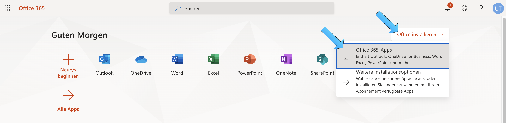

# Office 365 Installation 
{: .no_toc }

Auf dieser Seite wird beschrieben, wie du dein Microsoft Office 365 erstmalig zum Laufen bringst. Folgende Angaben musst du zwingend von der Schule zur Verfügung bekommen haben, um loslegen zu können:

```markdown
- Muristalden Email-Adresse, z.B. vorname.name@stud.muristalden.ch
- Initial-Passwort
```

Es wird empfohlen, die Installation in der folgenden Reihenfolge durchzuführen: 
{: .mb-6 }

<details open markdown="block">
  <summary>
    Inhalt
  </summary>
  {: .text-delta }
1. TOC
{:toc}
</details>

## Initial-Installation

1. Gehe auf [https://www.office.com](https://www.office.com/?omkt=de-CH), klicke auf _Anmelden_. Logge dich dann mit den zur Verfügung gestellten Anmeldedaten in das Office 365-Portal ein.  

2. Beim ersten Einloggen in das Office 365-Portal muss man sich registrieren. Dafür muss man sich mit einer privaten Email-Adresse und einer Handynummer identifizieren. Bitte diese Daten bereithalten und den Instruktionen beim erstmaligen Login von Microsoft folgen. 

3. Wenn du dich erfolgreich ins Portal eingeloggt hast, kannst du via _Office installieren_ und _Office 365-Apps_ das Microsoft Office 365-Paket herunterladen.

    

4. Nach erfolgreichem Download das Paket lokal installieren und den Anweisungen der Installations-Software folgen. Wenn die Installation erfolgt ist, sollten folgende Programme installiert sein:
    
    - Microsoft Teams
    - Microsoft OneDrive
    - Microsoft OneNote
    - Microsoft Word
    - Microsoft Excel
    - Microsoft Powerpoint
    - Microsoft Outlook

5. Starte eines der Programme. Du wirst nochmal aufgefordert dich mit deinen Login-Daten anzumelden. Danach solltest die alle Office-Programme verwenden können. 


## Microsoft OneDrive
xxx


## Microsoft Teams
xxx


## Microsoft Sharepoint
xxx


## Optional: Microsoft Outlook
xxx


## Optional: Microsoft Office 365 im Browser
xxx