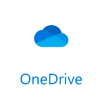
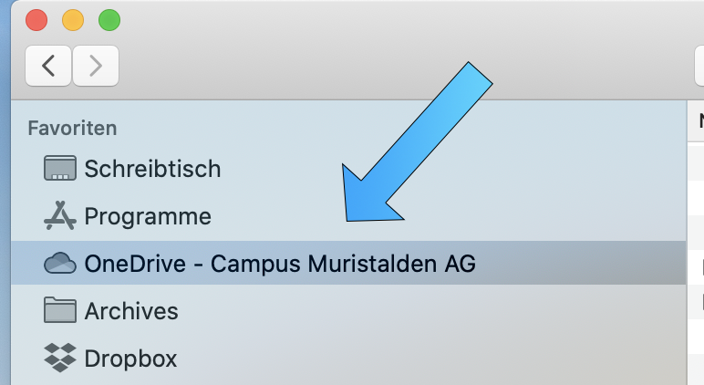
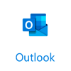
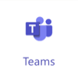
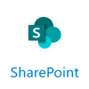

# Office 365 Installation 
{: .no_toc }

Auf dieser Seite wird beschrieben, wie du dein Microsoft Office 365 erstmalig zum Laufen bringst. Folgende Angaben musst du zwingend von der Schule zur Verfügung bekommen haben, um loslegen zu können:

```markdown
- Muristalden Email-Adresse, z.B. vorname.name@stud.muristalden.ch
- Initial-Passwort
```

Es wird empfohlen, die Installation in der folgenden Reihenfolge durchzuführen: 
{: .mb-6 }

<details open markdown="block">
  <summary>
    Inhalt
  </summary>
  {: .text-delta }
1. TOC
{:toc}
</details>

## Initial-Installation

1. Gehe auf [https://www.office.com](https://www.office.com/?omkt=de-CH), klicke auf _Anmelden_. Logge dich dann mit den zur Verfügung gestellten Anmeldedaten in das Microsoft 365-Portal ein.  

2. Beim ersten Einloggen in das Microsoft 365-Portal muss man sich registrieren. Dafür muss man sich mit einer privaten Email-Adresse und einer Handynummer identifizieren. Bitte diese Daten bereithalten und den Instruktionen beim erstmaligen Login von Microsoft folgen. 

3. Wenn du dich erfolgreich ins Portal eingeloggt hast, solltest du als erstes dein Passwort ändern. Wähle ein neues Passwort, dass sicher, aber auch gut merkbar ist. Hinweise dazu, wie man ein sicheres Passwort erstellt, findest du auf der Seite zum Thema [Passwortsicherheit](../docs/defence/passwoerter).

4. Nach dem Ändern des Passwortes kannst du via _Office installieren_ und _Office 365-Apps_ das Microsoft 365-Paket herunterladen.

    

5. Nach erfolgreichem Download das Paket lokal installieren und den Anweisungen der Installations-Software folgen. Wenn die Installation erfolgt ist, sollten folgende Programme installiert sein:
    
    - Microsoft Teams
    - Microsoft OneDrive
    - Microsoft OneNote
    - Microsoft Word
    - Microsoft Excel
    - Microsoft Powerpoint
    - Microsoft Outlook

6. Starte eines der Programme. Du wirst nochmal aufgefordert dich mit deinen Login-Daten anzumelden. Danach solltest du alle Office-Programme verwenden können. 

7. Probiere nun auch die anderen Programme aus, ob alles funktioniert. 

## Microsoft OneDrive



OneDrive ist eine Cloud-basierte Dateiablage. Mit einem Muristalden Microsoft 365 Account bekommst du 1TB in dieser Cloud zur Verfügung gestellt. Cloud heisst, dass du deine Daten sowohl auf deinem Computer, wie auch via Browser im Internet abrufen kannst. Nach der Installation von Microsoft 365 gemäss der Anleitung weiter oben sollte OneDrive bereits auf deinem System installiert sein. Im Explorer (Windows) oder im Finder (Mac) sollte der Ordner *OneDrive - Campus Muristalden AG* erstellt worden sein. Versuche diesen Ordner zu finden. Normalerweise kann nach der Installation automatisch über die Favoriten im Explorer/Finder darauf zugegriffen werden, siehe dazu den folgenden Screenshot. 




## Microsoft Outlook



Outlook ist ein Programm zum Verwalten von Emails. Das Einrichten von Outlook für die Schul-Email-Adresse wird sehr empfohlen. Nach der Einrichtung können Emails praktisch gelesen und geschrieben werden, ohne dass man sich immer mit dem Browser neu anmelden muss. Mit folgenden Schritten kann Outlook eingerichtet werden: 

1. xxx

2. xxx

3. xxx


## Microsoft Teams



xxx

## Microsoft Sharepoint



xxx


## Optional: Microsoft Office 365 im Browser
xxx