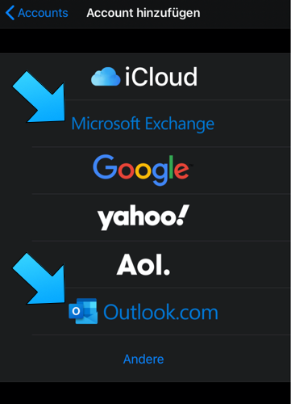
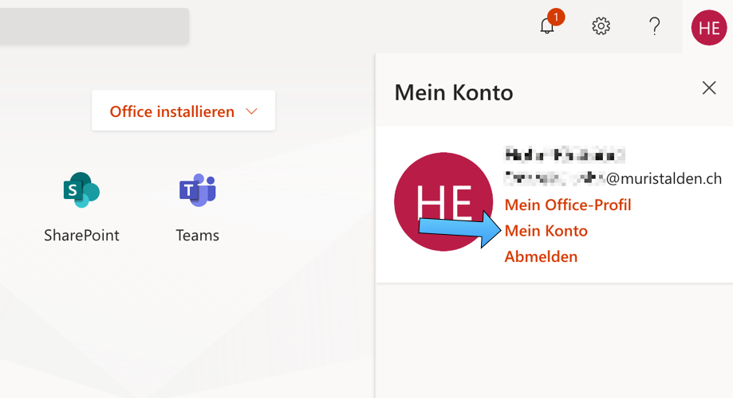
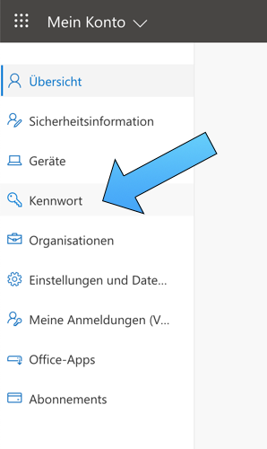

# Email, Schulnetz-Account und Passwort
{: .no_toc }

Auf dieser Seite findest du verschiedene Informationen zum Thema Emails abrufen, zum Umgang mit dem Schulnetz und wenn du Probleme mit deinem Passwort hast. 

{: .mb-6 }

  

    Inhalt
  

  {: .text-delta }
1. TOC
{:toc}

## Emails im Browser abrufen

Emails können einfach und geräteunabhängig online über den Browser abgerufen werden. Dazu gibt es zwei Möglichkeiten:

- Direkt bei Outlook einloggen (OWA - Outlook Web Access): [https://outlook.office365.com/mail](https://outlook.office365.com/mail). 
- Alternativ zuerst bei [https://www.office.com](https://www.office.com) einloggen (z.B. weil einfacher zu merken). Einmal bei Office eingeloggt kann man oben links über die Navigation (9 Punkte-Symbol) in die Outlook Web App wechseln. 

## Emails lokal mit Outlook abrufen

Inhalt folgt...

## Emails auf dem Smartphone abrufen

Beim Einrichten auf der Standard-Email-App deines Smartphones ist es wichtig, wenn möglich als Account-Typ eine der folgenden Optionen auszuwählen:

- Microsoft 365
- Outlook.com
- Microsoft Exchange

Auf einem iPhone gehen beide der folgend markierten Optionen:

Die Installationen eines Email Accounts auf einem Smartphone ist je nach Modell verschieden. Eine Anleitung für verschiedene Smartphone-Modelle findet man auf der offiziellen Hilfe Seite von Microsoft, z.B. [hier](https://support.microsoft.com/de-de/office/einrichten-von-ger%C3%A4ten-f%C3%BCr-office-365-7fb4b75b-b939-4241-bc84-6bd9b90a7a64). 

## Passwort ändern

Zum Ändern des Passwortes muss man sich mit dem Browser in das Microsoft 365 Portal einloggen, z.B. unter [https://www.office.com](https://www.office.com). Nach dem erfolgreichen Einloggen kann man ganz oben rechts auf seinen Account klicken (man sieht entweder ein Kürzel oder sein ausgewähltes Profilfoto). Danach geht ein Optionsmenü auf, klicke da dann auf *Mein Konto*. Danach gibt es links in der Navigation die Möglichkeit, das Kennwort zu ändern. Siehe dazu auch die folgenden Screenshots.

## Passwort vergessen

Bei einem Verlust des Passwortes kann ein Passwort-Reset nur via Email beantragt werden. Dafür bitte ein Email an [it-support@muristalden.ch](mailto:it-support@muristalden.ch) senden. Das Email muss von der bei Office 365 hinterlegten privaten Email Adresse gesendet werden. 

## Schulnetz-Account

Inhalt folgt...
